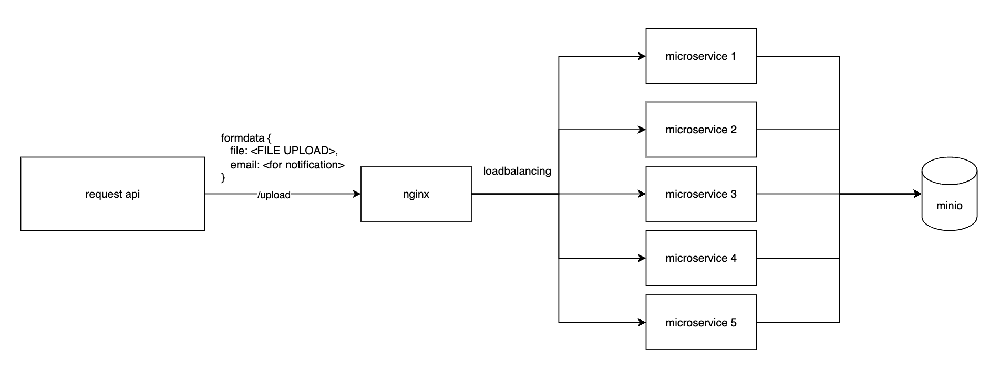

# File Upload Service
Please implement a production grade microservice, in any programming language or framework, to receive a file upload request and store the file and send email notification. Following concerns need to be addressed
1.  Security
2.  Scalability
3.  Testability
4.  API Standard (RESTFul)

## Table of Contents
 - [Tech stack](#tech-stack)
 - [Installation](#installation)
 - [Usage](#usage)

## Tech Stack

 - **Nodejs** (express) as microservice, for interface upload file, email send
 - **MiniO** as file storage 
 - **Nginx** for load balanceing
 - **Docker, Docker-compose** as container and container orchestration

## Installation
```bash
# Clone the repository 
git clone git@github.com:nashzii/interview-file-upload.git
# Change directory  
cd interview-file-upload 
# Install dependencies npm install
npm install
```
## Usage
require [node](https://nodejs.org/en) version 18.x+
require [docker](https://www.docker.com/) and [docker-compose](https://docs.docker.com/compose/) before use
```bash
# to build docker image
docker build -t upload-app . 
# running rest of service with docker compose
docker-compose up -d
```
to access MiniO web console
http://localhost:9090/browser
user: ADMIN, password: P@ssw0rd

to send request for upload file
```bash
curl --location 'http://localhost/upload' \
--form 'file=@"/Users/nashzii/Desktop/photo.png"' \
--form 'email="your_email@hotmail.com"'
```

Why **.env** exist in repo ? for interview and take home assignment propose